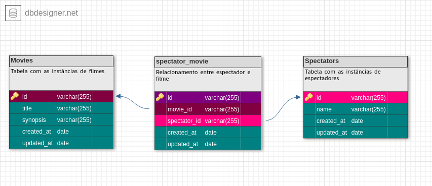

## Desafio Backend

### Objetivo

Construir uma sistema de controle de filmes, onde é possível cadastrar filmes e espectadores e relacionar espectadores e filmes.

## Database

Como um espectador pode assistir mutos filmes e um filme pode ser assistido por muitos espectadores estruturei o banco de dados da seguinte forma:

<h3 align="left">
  
<h3>

## Tecnologias utilizadas

- Typescript
- Typeorm
- express
- postgres

## Rodando a aplicação

1. Faça o clone do repositório do código e entre no novo diretório criado

```
git clone git@github.com:abelsouzacosta/wedecode-challenge.git

cd wedecode-challenge

```

2. Neste projeto foi usado o typeorm, para que seja possível fazer o uso de migrations é preciso ter o pacote `ts-node` instalado globalmente, se você não possuir este pacote instalado de forma global pode instalá-lo usando o comando:

`npm -g install ts-node` ou `sudo npm -g install ts-node` (caso em ambiente linux)

3. Renomeie os arquivos `.env.local` e `.ormconfig.env` para `.env` e `ormconfig.env`, respectivamente;

4. Dentro de `.env` determine a porta da aplicação (ex: _3030_)

5. Crie um banco de dados postgres com um nome qualquer de sua preferência (ex: _CHALLENGE_)

6. A biblioteca de uuids do postgres não é estabelecida por padrão na criação de um novo banco de dados, como usei uuids para identificar as instâncias da aplicação temos de instalar a biblioteca, pode ser feito da seguinte forma:

```
\c <nome_do_banco_criado>

nome_do_banco_criado=# CREATE EXTENSION IF NOT EXISTS "uuid-ossp";

```

A biblioteca estará instalada e é possível ir para a próxima etapa

7. No arquivo `ormconfig.env` determine os valores das variáveis `TYPEORM_USERNAME`, `TYPEORM_PASSWORD` e `TYPEORM_DATABASE` com o usuário do banco de dados, a senha e o nome do banco de dados criado no passo anterior.

8. Execute as migrations com o comando: `yarn typeorm migration:run`

9. Inicialize o servidor da aplicação com: `yarn dev`

## Rotas

<b>[GET]</b>/movies - Retorna todas as instâncias de filmes cadastrados no banco de dados da aplicação

<b>[GET]</b>/movies:id: - Retorna os detalhes de um determinado filme identificado pelo `id` passado, na resposta desse endpoint é possível visualizar a _quantidade de espectadores_ do filme, a resposta estará estruturada da seguinte forma:

```
{
  "movie": {
    "id": "0af37ce2-6d0c-41f1-9a5f-03f267614bfe",
    "title": "Missão: Impossível",
    "synopsis": "Durante uma missão de rotina em Praga, capital da República Tcheca na Europa, Ethan Hunt e seu grupo de agentes caem numa emboscada. Ethan descobre que apenas ele e uma outra agente sobreviveram.",
    "created_at": "2021-07-27T03:41:47.544Z",
    "updated_at": "2021-07-27T03:41:47.544Z"
  },
  "total_spectators": 1
}

```

<b>[POST]</b>/movies - Cria uma nova instância de filme no banco de dados da aplicação, o corpo da requisição deve estar estruturado da seguinte forma:

```
{
	"title": "Missão: Impossível",
	"synopsis": "Durante uma missão de rotina em Praga, capital da República Tcheca na Europa, Ethan Hunt e seu grupo de agentes caem numa emboscada. Ethan descobre que apenas ele e uma outra agente sobreviveram."
}

```

<b>[GET]</b>/spectators - Retorna uma lista de todos os espectadores cadastrados no banco de dados

<b>[GET]</b>/spectators/:id: - Retorna os detalhes do espectador identificado pelo `id`, na resposta desse endpoint é possível visualizar quantos filmes o espectador já assistiu, a resposta estará estruturada da seguinte forma:

```
{
  "spectator": {
    "id": "ce7f0365-8aa3-4781-9ba4-6466e7683c86",
    "name": "Abel Souza",
    "created_at": "2021-07-27T05:14:57.286Z",
    "updated_at": "2021-07-27T05:14:57.286Z"
  },
  "movies_watched": 1
}

```

<b>[POST]</b>/spectators - Cria uma nova instância de espectador no banco de dados, o corpo da requisição deve estar estruturado da seguinte forma:

```
{
	"name": "Abel Souza"
}

```

<b>[POST]</b>/spectators/:id:/set_watched - Relaciona um espectador identificado pelo `id` passado no parâmetro da requisição com um determinado filme que deve ser determinado no corpo da requisição, este corpo deve estar na seguinte forma:

```
{
	"movie_id": "0af37ce2-6d0c-41f1-9a5f-03f267614bfe"
}

```

Abel Souza ©️
